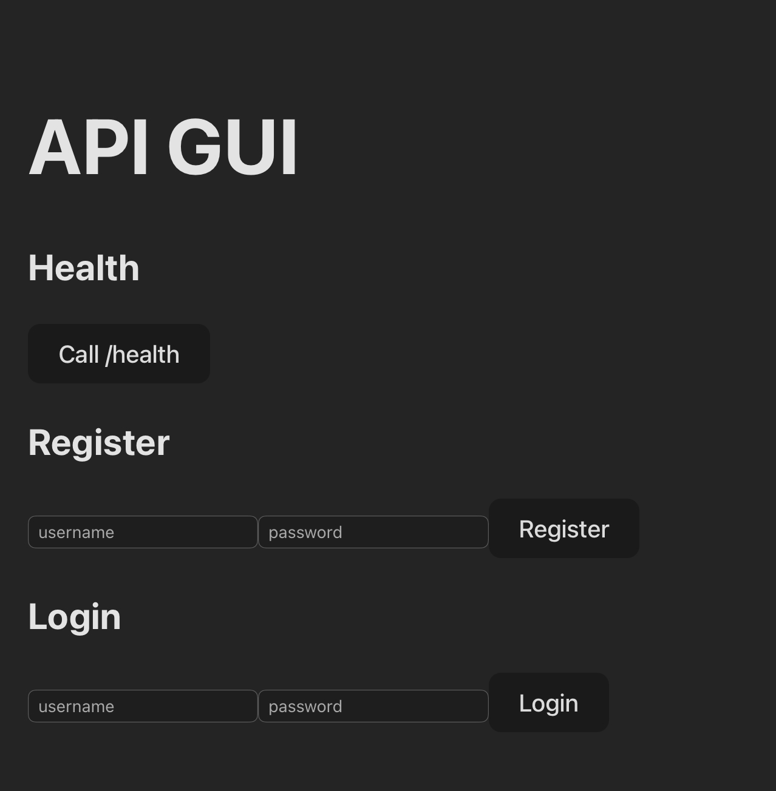
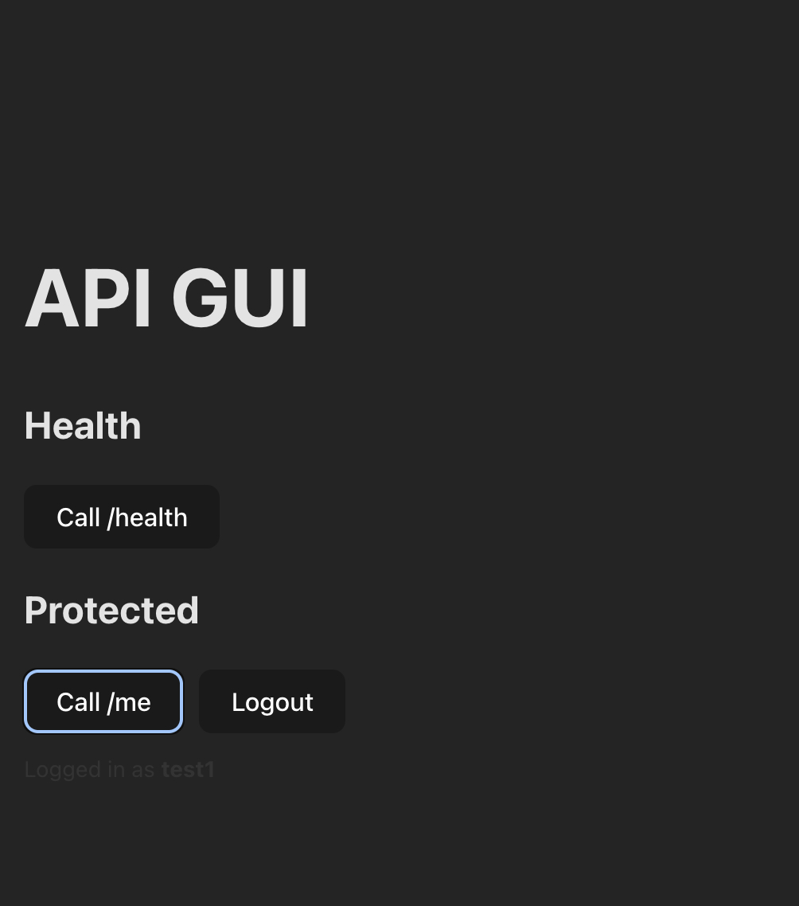

# Nimbus Core – Cloud-Deployed Backend Service

Nimbus Core is a cloud-deployed service with a strong emphasis on a secure backend API, supported by a minimal frontend GUI for validation. The platform runs on real, self-managed cloud infrastructure using containerization and environment-based configuration.

This repository is designed to be portable and runnable using environment variables (no secrets committed).

## Demo Screenshots

### Frontend Authentication Flow





## Project Roles & Contributions

### Backend & Application (Bereket)
- Designed and implemented the core backend API  
- Implemented JWT-based authentication and protected routes  
- Integrated PostgreSQL with application-level validation  
- Built a minimal frontend GUI to validate authentication flows  
- Structured and documented the project for clarity and portability  

### Infrastructure & Deployment (Sam)
- Provisioned and managed cloud server infrastructure  
- Containerized services for deployment  
- Configured networking, ports, and runtime environment  
- Integrated and maintained the live backend system  

---

## Core Features

### Accounts and sessions
- Registration and login, BCrypt-hashed passwords (cost 12, unique random salt per password)
- Sessions are **rows in the database**, handed to the browser as an opaque token in an
  `HttpOnly` + `SameSite=Strict` cookie — page scripts cannot read it, so an XSS bug has
  no credential to steal, and any session can be revoked instantly
- CSRF double-submit tokens on every state-changing request
- Sliding idle expiry, hourly purge of dead sessions

### Account settings
- Change password (re-authenticates, then signs out every *other* device)
- List active sessions with IP, user agent and last-seen; revoke one or all
- Mint short-lived bearer tokens for scripts and CI
- Delete account — removes the user, every session and all their tickets

### Website hosting
- Each account provisions websites by slug and uploads static files through the GUI or API
- **Every site runs in its own container** — read-only rootfs, all capabilities dropped,
  64MB RAM, 64 pids, 0.25 CPU, no published ports, and an internal-only network with no
  route to the internet
- Per-account storage quota enforced on every upload, across all of that account's sites
- Path traversal refused segment-by-segment and again after normalisation; uploads are
  written to a temp file and moved into place, so a rejected upload never goes live
- Served at `/s/<slug>/` with zero DNS, or at `<slug>.sites.<domain>` with a wildcard record

### Tickets
- Help and change requests, with threaded comments and an
  `OPEN` / `IN_PROGRESS` / `CLOSED` workflow
- Every query is scoped to the owning user; someone else's ticket returns 404, never 403

### Status
- Public `/status` reporting uptime, start time and live database connectivity
- Answers `503` when degraded, so an uptime monitor can key off the status code
- Auto-refreshing status page at `/status.html`

### Frontend
- Static multi-page GUI, vanilla JS, no build step
- Strict CSP (`script-src 'self'`, no `unsafe-inline`) — all JS and styles are external files
- Served by nginx, which reverse-proxies `/api/` to the backend

---

## Tech Stack

**Backend**
- Java 17, Spring Boot 4, Spring Security
- PostgreSQL, JPA / Hibernate, Maven
- Database-backed sessions for browsers; JWT bearer tokens for API clients

**Frontend**
- Static HTML / CSS / vanilla JS
- nginx (static hosting + `/api/` reverse proxy)
---

## Project Structure

```
nimbus-core/
├── Backend/
│   ├── Dockerfile              # multi-stage: Temurin JDK 21 build -> JRE runtime
│   ├── pom.xml
│   └── src/main/java/com/nimbus/api/
│       ├── account/            # /me: profile, password, sessions, API tokens, deletion
│       ├── controller/         # /health, /protected
│       ├── jwt/                # bearer tokens for scripts and CI
│       ├── security/           # filter chain, CSRF, session + bearer auth filters
│       ├── session/            # database-backed sessions, cookie issuance
│       ├── site/               # website provisioning, uploads, quotas
│       ├── status/             # /status uptime + dependency checks
│       ├── ticket/             # help / change requests and comments
│       └── user/               # registration, login, logout
├── Frontend/
│   ├── Dockerfile              # nginx, static site baked in
│   ├── nginx/
│   │   ├── 00-ratelimit.conf   # separate limit_req zones for login / register
│   │   ├── 10-nimbus-gui.conf  # app + /api proxy + /s/<slug>/ routing
│   │   ├── 20-nimbus-sites.conf# <slug>.sites.<domain> routing (needs wildcard DNS)
│   │   └── site-container.conf # the config every customer site container runs
│   └── public/                 # document root
│       ├── index.html  login.html  register.html  dashboard.html
│       ├── account.html  tickets.html  status.html  sites.html
│       └── assets/             # styles.css, config.js, app.js, <page>.js
├── docker-compose.yml          # db (isolated) + backend + web
├── bootstrap.sh                # fresh Debian box -> running stack, one command
├── run.sh                      # build / start / stop / logs
├── site-reconciler.sh          # creates/removes per-site containers (host side)
├── verify.sh                   # end-to-end test of every endpoint
├── harden-ssh.sh               # hardens the HOST sshd (run on the server)
├── data/sites/                 # customer site files (the flash drive mount point)
├── local-notes/                # gitignored: Postgres, remote access, flash drive
├── .env.example
└── README.md
```

---

## Environment Variables

`run.sh` generates a `.env` with strong random secrets on first run, so there is
usually nothing to do by hand. See `.env.example` for the full list.

| Variable | Purpose |
|---|---|
| `POSTGRES_DB` / `POSTGRES_USER` / `POSTGRES_PASSWORD` | Database credentials. The backend builds its JDBC URL from these; Postgres is never reachable outside the container network. |
| `JWT_SECRET` | HS256 signing key. **Must be ≥ 32 bytes** — the app refuses to start otherwise. Rotating it invalidates every issued token. |
| `JWT_EXPIRATION_MS` | Bearer token lifetime (default 600000 = 10 min). |
| `APP_SESSION_TTL_MINUTES` | Browser session idle timeout (default 720 = 12h). The window slides forward on every authenticated request. |
| `APP_SECURE_COOKIES` | `false` for plain HTTP on localhost. **Set `true` once a TLS front end is in place** — adds `Secure` to the session and CSRF cookies. |
| `APP_BCRYPT_STRENGTH` | Password hashing work factor, log2 rounds (default 12). Drop to 10 on a low-power ARM board if logins feel slow. Never below 10. |
| `APP_CORS_ALLOWED_ORIGIN_PATTERNS` | Leave **empty** for same-origin (correct behind the bundled nginx). Set only if a browser on another origin must call the API. |

`.env` is gitignored and written mode `600`. Never commit it.

---

## Running

Everything runs in containers.

**On a fresh Debian machine** (arm64 or amd64), one command does the lot —
installs Docker and the compose plugin from Docker's own repo, generates
secrets, builds, starts, and health-checks. It also reports the two things that
fail silently in a container or on the wrong storage: the Docker storage driver
and whether cgroup limits are actually available.

```bash
git clone https://github.com/kizzycpt/nimbus-core.git
cd nimbus-core
sudo ./bootstrap.sh
```

`./bootstrap.sh --check` reports what is already present without changing
anything; `--skip-docker` skips the install step.

**If Docker is already set up**, skip straight to:

```bash
./run.sh
```

That builds the images, starts the stack, waits for every container to report
healthy, and smoke-tests the API through nginx.

**To prove it actually works**, run the end-to-end suite. It creates a
throwaway account, exercises CSRF, sessions, tickets and account settings
through nginx exactly as a browser would, then deletes the account again:

```bash
./verify.sh
```

nginx rate-limits the auth endpoints to 5/min, so back-to-back runs will trip
the limiter — use `./verify.sh --wait` to sit out the window automatically.

| Command | Effect |
|---|---|
| `./run.sh` | Build if needed and start |
| `./run.sh rebuild` | Clean rebuild (`--no-cache --pull`) and restart |
| `./run.sh logs` | Follow logs |
| `./run.sh status` | Container and health state |
| `./run.sh down` | Stop; **keeps** the database volume |
| `./run.sh destroy` | Stop and **delete** the database volume (prompts for confirmation) |

Once up:

- GUI — `http://127.0.0.1:8080/`
- API — `http://127.0.0.1:8080/api/health`

### Container layout

| Service | Image | Host port | Notes |
|---|---|---|---|
| `db` | `postgres:16` | **none** | On an `internal: true` network — no host port, no LAN exposure, no outbound internet. SCRAM-SHA-256 auth. |
| `backend` | built from `Backend/` | **none** | Reachable only through nginx. Runs as UID 10001, read-only rootfs, all capabilities dropped. |
| `web` | built from `Frontend/` | `127.0.0.1:8080` | The only published port, bound to loopback. Read-only rootfs. |

To reach the database (psql needs the password passed in — there is no TTY to
prompt on):

```bash
set -a; source .env; set +a
docker compose exec -e PGPASSWORD="$POSTGRES_PASSWORD" db \
  psql -U "$POSTGRES_USER" -d "$POSTGRES_DB"
```

More, including backup/restore and the schema: `local-notes/postgres.txt`.

### How customer websites work

```
                    ┌────────────────────────────────────┐
  browser ────────► │ web (nginx)   127.0.0.1:8080       │
                    │  /            control panel        │
                    │  /api/   ───► backend              │
                    │  /s/<slug>/ ─► nimbus-site-<slug>  │
                    └────────────────────────────────────┘
                                     │
        ┌────────────────────────────┴─────────────────────────┐
        │  sitenet (internal: no route to the internet)        │
        │   nimbus-site-alice   nimbus-site-bob   ...          │
        │   read-only rootfs · caps dropped · 64MB · 0.25 CPU  │
        └──────────────────────────────────────────────────────┘
                                     │ read-only bind mount
                          NIMBUS_SITES_DIR/<slug>/public
                                     ▲ writes
                                  backend
```

**The API never talks to Docker.** Giving a network-facing Spring app the
Docker socket is giving it root on the host, so the split is:

| Owns | Component |
|---|---|
| Site records, files, quotas | `backend` — writes only to `NIMBUS_SITES_DIR` |
| Container lifecycle | `site-reconciler.sh` — runs on the host |

The reconciler compares directories on disk against containers labelled
`nimbus.role=site` and fixes the difference. It is idempotent and self-healing:
it creates containers for new sites, restarts ones that died, and removes ones
whose directory is gone. Run it on a timer:

```bash
sudo ./site-reconciler.sh --install     # systemd timer, every 30s
./site-reconciler.sh --dry-run          # show what would change
```

The cost of this design is latency — a new site is live within one reconcile
interval rather than instantly. That is a good trade for not putting root on
the host behind an HTTP endpoint.

#### Isolation, and the trap in path-based hosting

Serving customer HTML from the same origin as the control panel would make
customer JavaScript same-origin with the app: it could `fetch('/api/me')` with a
logged-in visitor's session cookie, read the CSRF token, and take over the
account. Two things prevent that:

1. Customer responses carry `Content-Security-Policy: sandbox`, which puts the
   document in an **opaque origin**. Its requests to `/api` are then cross-origin,
   so the `SameSite=Strict` session cookie is never attached.
2. Cookies are stripped before the request reaches the site container.

`verify.sh` asserts the sandbox header is present. The stronger boundary is a
separate hostname — `20-nimbus-sites.conf` serves the same containers at
`<slug>.sites.<domain>` and activates as soon as a wildcard DNS record points
here. **Use it in production.**

### Resource footprint

Measured, idle, after tuning:

| | memory | limit |
|---|---|---|
| `db` | 17 MB | 512 MB |
| `backend` (JVM) | 326 MB | 768 MB |
| `web` (edge nginx) | 5 MB | 128 MB |
| **control plane** | **~373 MB** | |
| each customer site | **2.7 MB** | 64 MB |

Measured at 101 site containers: 276 MB total, all serving, p50 0.4 ms through
the proxy, control panel unaffected. A no-op reconcile pass takes 1.2 s at that
count and grows linearly — past roughly 500 sites, move to generated vhosts on
a shared nginx.

**`worker_processes` is pinned** to 1 for site containers and 2 for the edge, in
`site-nginx.conf` / `main-nginx.conf`. nginx defaults to `auto`, meaning one
worker per *host* core — on a 28-core box that was 28 workers per static site
and 21.7 MB instead of 2.7 MB. The image's autotune script cannot fix it here
because it rewrites `nginx.conf` with `sed` and these containers have a
read-only rootfs, so the write fails silently.

Database growth is negligible: 5,000 users plus 5,000 active sessions measured
3 MB of table data, about 600 bytes per user.

All containers cap their logs (10 MB × 3 for services, 5 MB × 2 per site).
Docker's `json-file` driver does not rotate by default, and on a long-running
box that is what fills the disk.

### Exposing it publicly

The nginx port is bound to `127.0.0.1` on purpose. Put a TLS terminator in
front of it — `cloudflared`, Caddy, or a host nginx — rather than changing the
bind address to `0.0.0.0`. If you do publish it directly, set
`APP_CORS_ALLOWED_ORIGIN_PATTERNS` to the exact origin, never `*`.

---

## Auth Flow Overview

Browsers and API clients authenticate differently, on purpose.

**Browser (cookie session)**

1. The page loads and picks up a CSRF token — readable `XSRF-TOKEN` cookie, or `GET /api/csrf`.
2. `POST /api/register` or `/api/login` with the token echoed in `X-XSRF-TOKEN`.
3. The server creates a `sessions` row and returns an opaque 256-bit token in a
   `HttpOnly; SameSite=Strict; Path=/` cookie. Only its SHA-256 is stored, so a
   database dump cannot be replayed as a login.
4. The browser attaches that cookie automatically. Every mutating request must also
   carry the CSRF header, so another site cannot forge one.
5. Each authenticated request slides the expiry forward. `POST /api/logout` deletes the row.

**Scripts and CI (bearer token)**

1. Sign in as above, then `POST /api/me/api-token`.
2. Send `Authorization: Bearer <token>`. CSRF does not apply — a bearer token is not
   ambient credentials, so it cannot be forged by a third-party site.

### Endpoints

| Method | Path | Auth | Purpose |
|---|---|---|---|
| `GET` | `/health` | public | Liveness ping |
| `GET` | `/status` | public | Uptime + database check (`503` when degraded) |
| `GET` | `/csrf` | public | Mint a CSRF token |
| `POST` | `/register` | public | Create an account, signs you in |
| `POST` | `/login` | public | Sign in |
| `POST` | `/logout` | session | Revoke this session |
| `GET` | `/protected` | any | Proves auth works end to end |
| `GET` | `/me` | any | Profile, session count, open tickets |
| `POST` | `/me/password` | any | Change password; revokes other sessions |
| `GET` | `/me/sessions` | any | List active sessions |
| `DELETE` | `/me/sessions/{id}` | any | Revoke one session |
| `DELETE` | `/me/sessions` | any | Revoke all *other* sessions |
| `POST` | `/me/api-token` | any | Mint a bearer token |
| `POST` | `/me/delete` | any | Delete the account (password required) |
| `GET`/`POST` | `/tickets` | any | List / create tickets |
| `GET`/`PATCH`/`DELETE` | `/tickets/{id}` | any | Read / set status / delete |
| `POST` | `/tickets/{id}/comments` | any | Reply on a ticket |
| `GET`/`POST` | `/sites` | any | List sites + quota usage / provision a site |
| `GET` | `/sites/{slug}/files` | any | List uploaded files |
| `POST` | `/sites/{slug}/files` | any | Upload a file (multipart) |
| `DELETE` | `/sites/{slug}/files/**` | any | Delete a file |
| `DELETE` | `/sites/{slug}` | any | Delete a site and everything in it |

Behind nginx every path is prefixed with `/api`. `/api/actuator` is refused at
the edge.

---

## Demo (curl, through nginx)

```bash
JAR=$(mktemp)
BASE=http://127.0.0.1:8080/api

# 1. pick up a CSRF token
curl -s -c $JAR -b $JAR $BASE/csrf > /dev/null
CSRF=$(grep XSRF-TOKEN $JAR | awk '{print $7}')

# 2. register — the session cookie lands in the jar
curl -s -c $JAR -b $JAR -X POST $BASE/register \
  -H 'Content-Type: application/json' -H "X-XSRF-TOKEN: $CSRF" \
  -d '{"username":"demo","password":"correct-horse-battery"}'

# 3. the cookie alone authenticates from here on
curl -s -b $JAR $BASE/me
curl -s -b $JAR $BASE/protected

# 4. raise a ticket (CSRF token rotates, so re-read it)
CSRF=$(grep XSRF-TOKEN $JAR | awk '{print $7}')
curl -s -c $JAR -b $JAR -X POST $BASE/tickets \
  -H 'Content-Type: application/json' -H "X-XSRF-TOKEN: $CSRF" \
  -d '{"subject":"Disk full","body":"Need more space.","kind":"CHANGE"}'

# public, no auth needed
curl -s $BASE/status
```

Without the CSRF header, step 2 returns `403` — that is the protection working.

---

## Notes
- No secrets are committed to the repository; `.env` is generated and gitignored
- `local-notes/` is gitignored — Postgres runbook and remote-access (Tailscale /
  Cloudflare Tunnel / port-forward) instructions live there
- Passwords are BCrypt with a unique random salt per password; the raw session
  token is never stored, only its SHA-256
- `harden-ssh.sh` hardens the **host's** sshd and refuses to disable password
  auth until it can prove a working public key exists
